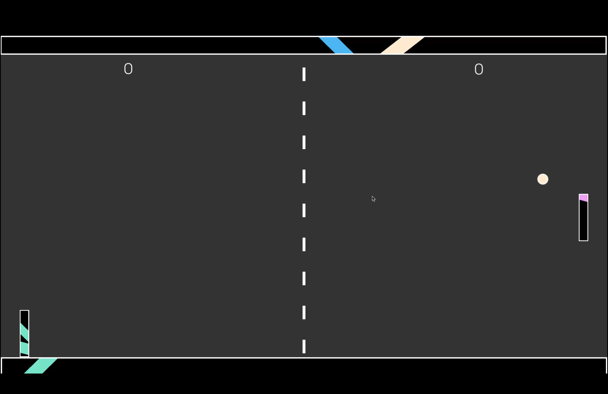

# Fancy Pong in Godot 4
This is a version of Pong created in Godot 4 with lots of shader effects and a scalable game mode system. I'm creating a [youtube series](https://www.youtube.com/watch?v=QxK2Vy0yrjY&t=1s) alongside it about how to create it yourself! 

 
